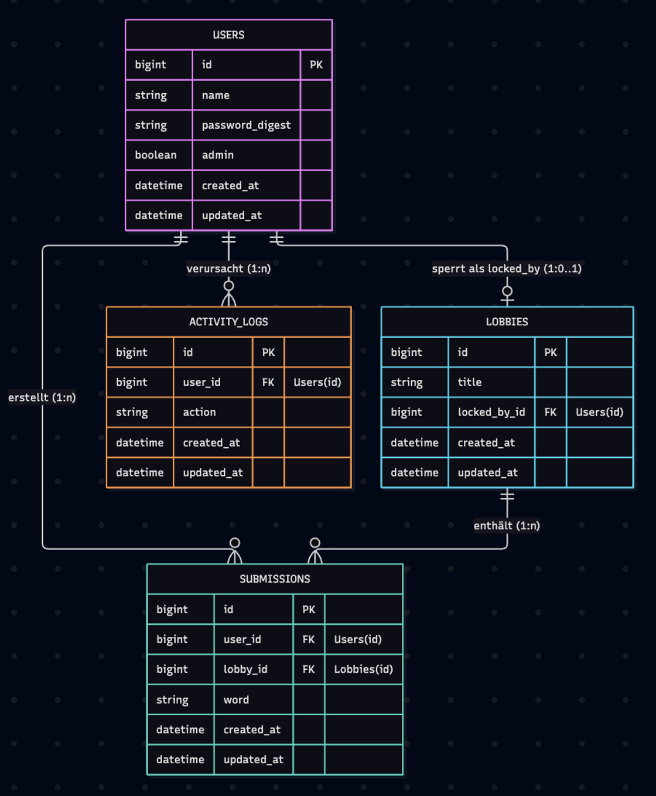
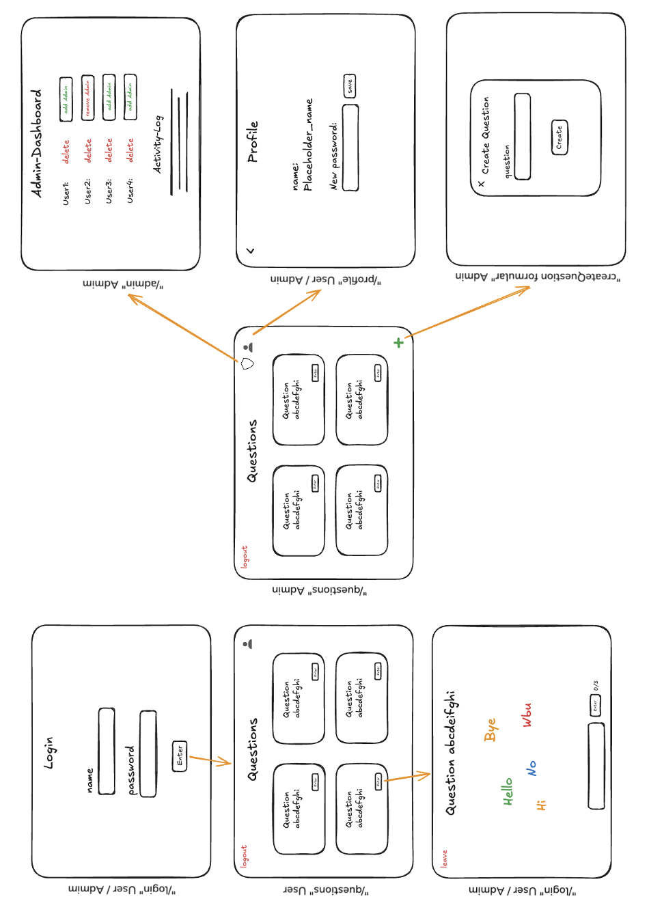
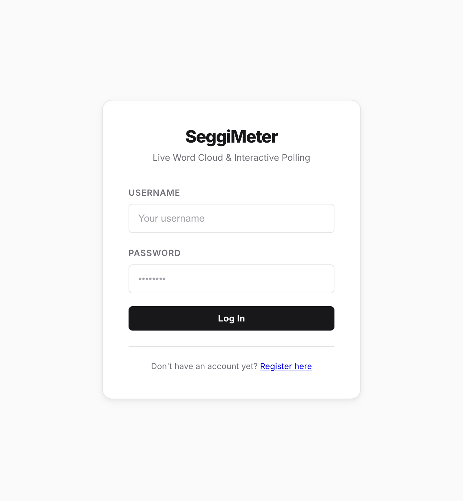
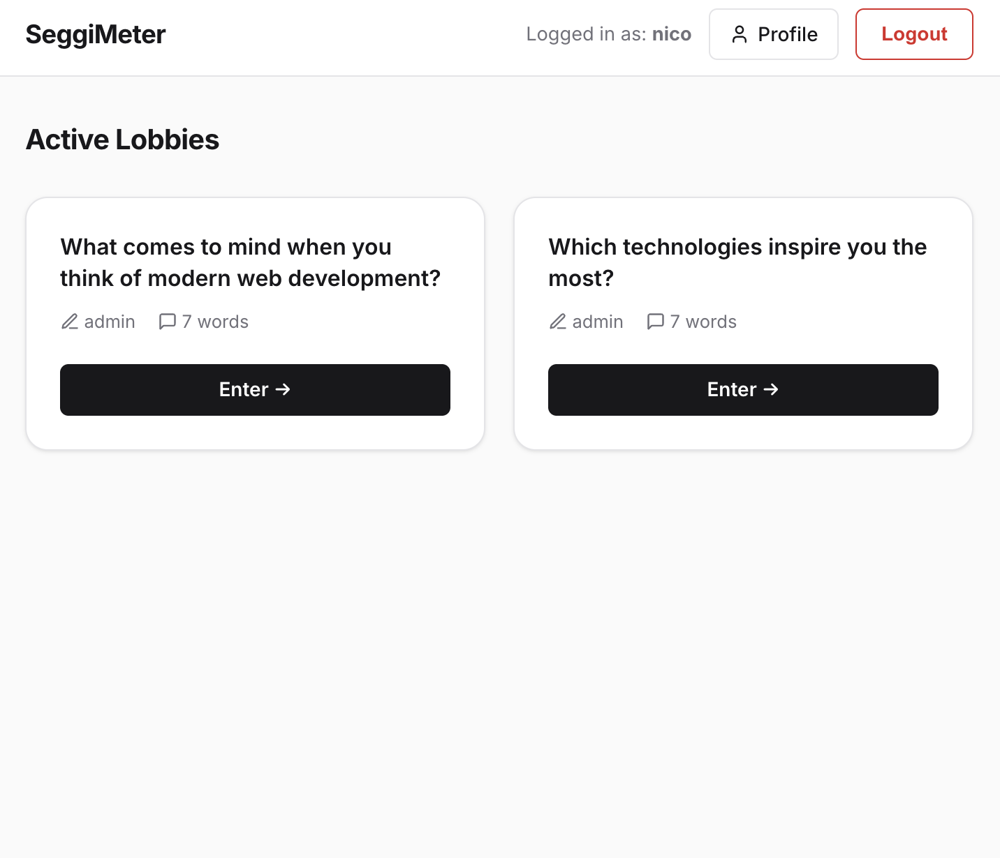
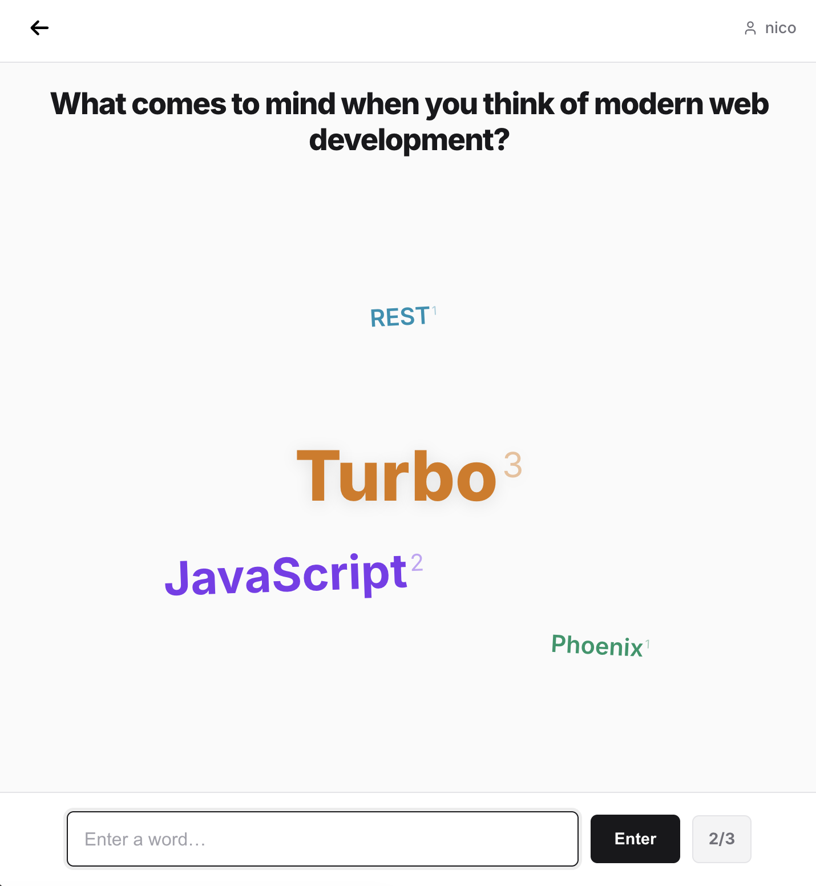
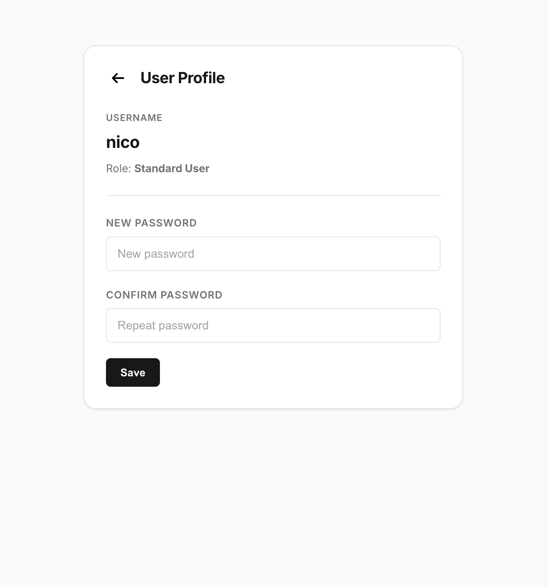

# Projektdokumentation SeggiMeter

**Modul:** Modul 223 – Multi-User-Applikationen objektorientiert realisieren
**Datum:** 25.09.2026
**Autor:** Damian Segginger
**Schulklasse:** 24E

---

## 1. Problemstellung & Vision

### 1.1 Ausgangslage

In Präsentationen, Vorlesungen und Meetings ist interaktives Publikum-Feedback entscheidend für die Dynamik und Wissensvermittlung.

### 1.2 Problemstellung

SeggiMeter ist eine webbasierte Anwendung (angelehnt an Mentimeter oder Slido), mit der Referenten interaktive „Lobbies" erstellen können, in denen Teilnehmer in Echtzeit Begriffe einreichen. Diese Begriffe werden dynamisch als Wortwolke (Word Cloud) visualisiert.

### 1.3 Domäne

Bildungsbereich, Moderation & Event-Management (interaktive Publikums-Einbindung).

### 1.4 Vision

Eine leichtgewichtige, barrierefreie Alternative zu komplexen Tools schaffen, die es Personen erlaubt, ohne Aufwand innerhalb weniger Sekunden Meinungen und Fachbegriffe einer Gruppe visuell zusammenzufassen.

### 1.5 Abgrenzung / Scope der 1. MVP-Iteration

| | Inhalt |
|---|---|
| **In-Scope** | Erstellen einer Lobby durch den Admin, Beitreten via Login durch Teilnehmer, Echtzeit-Übermittlung von Begriffen, dynamische Generierung der Wortwolke |
| **Out-of-Scope** (spätere Versionen) | Export der Wortwolke als PDF, private Lobbies mit Link/Code |

---

## 2. Anforderungen & Qualitätsattribute

### 2.1 Funktionale Anforderungen (FA)

| ID | Anforderung |
|---|---|
| FA-01 | Benutzer müssen sich registrieren und mit Benutzername/Passwort anmelden können. |
| FA-02 | Administratoren können Lobbies mit einem Titel (Fragestellung) erstellen, bearbeiten und löschen. |
| FA-03 | Angemeldete Nutzer können in einer Lobby Wörter einreichen, begrenzt auf max. 3 Wörter pro Nutzer und Lobby. |
| FA-04 | Eingereichte Wörter müssen in Echtzeit als aggregierte Wortwolke für alle Teilnehmenden sichtbar werden, ohne Seiten-Reload. |
| FA-05 | Beim gleichzeitigen Bearbeiten eines Lobby-Titels durch mehrere Admins darf nur eine Person gleichzeitig Schreibzugriff erhalten (Lock-Anzeige für andere). |
| FA-06 | Administratoren können im Admin-Bereich Benutzer verwalten (Rollen vergeben/entziehen, Konten löschen), mit Schutz vor versehentlicher Selbstdeaktivierung. |
| FA-07 | Relevante Systemaktionen (Login, Wortabgabe, Lobby-Änderungen, Adminrechte etc.) müssen nachvollziehbar protokolliert werden. |
| FA-08 | Nutzer können ihr eigenes Passwort ändern. |

### 2.2 Nicht-funktionale Anforderungen / Qualitätsattribute (NFA)

| ID | Anforderung |
|---|---|
| NFA-01 | **Datenkonsistenz:** Wortabgabe und Protokolleintrag müssen atomar erfolgen – bei Fehlern vollständiger Rollback. |
| NFA-02 | **Nebenläufigkeitssicherheit:** Konkurrierende Schreibzugriffe auf dieselbe Lobby dürfen keine inkonsistenten Zustände erzeugen (Pessimistic Locking). |
| NFA-03 | **Sicherheit:** Passwörter werden nie im Klartext gespeichert (Hashing, Mindestlänge), Zugriffsrechte werden serverseitig geprüft. |
| NFA-04 | **Wartbarkeit:** Code folgt einheitlichen Stilrichtlinien und wird automatisiert auf Sicherheitslücken geprüft. |
| NFA-05 | **Testbarkeit:** Kernfunktionen (Modelle, Controller-Rechte, Transaktionen, Locking) müssen automatisiert testbar sein. |
| NFA-06 | **Antwortverhalten:** UI-Aktualisierungen (Wortwolke, Lobby-Titel) sollen ohne merkliche Verzögerung erfolgen. |

---

## 3. Rollen & Berechtigungen

| Rolle | Berechtigungen |
|---|---|
| **Standard-User** | Registrieren/Anmelden, Lobbies beitreten, max. 3 Wörter pro Lobby einreichen, eigenes Profil/Passwort verwalten |
| **Administrator** (`admin`-Flag im User-Model) | Alle Rechte des Standard-Users, zusätzlich: Lobbies erstellen/bearbeiten/löschen, Benutzerverwaltung im Admin-Bereich (`/admin`), Einsicht in das Aktivitätsprotokoll |

Rollenprüfung erfolgt serverseitig über den `require_admin`-Filter im `ApplicationController` sowie über Pundit-Policies (`UserPolicy`) für die Admin-Benutzerverwaltung.

---

## 4. Domänenmodell

### 4.1 Entity-Relationship-Modell



Das System besteht aus 4 relationalen Tabellen mit Fremdschlüsseln und Indizes: `users`, `lobbies`, `submissions`, `activity_logs` (siehe `db/schema.rb`).

### 4.2 Domänensprache (Ubiquitous Language)

| Begriff | Bedeutung |
|---|---|
| **Lobby** | Der interaktive Raum, in dem Umfragen stattfinden. |
| **Submission** | Die von einem Benutzer eingereichte Wort-Antwort. |
| **Word Cloud** | Die visuelle Wortwolken-Darstellung. |
| **ActivityLog** | Audit-Protokoll aller systemkritischen Aktionen. |
| **Locking** | Der Sperrzustand einer Lobby während einer Titelbearbeitung. |

---

## 5. GUI-Konzept

### 5.1 Wireframes (erster Entwurf)



### 5.2 Screens der ersten Iteration

| Screen | Beschreibung |
|---|---|
|  | Login-Seite mit Registrierungs-Link |
|  | Übersicht aktiver Lobbies mit Ersteller und Anzahl eingereichter Wörter |
|  | Lobby-Ansicht mit Echtzeit-Wortwolke und Eingabefeld (Zähler „x/3") |
|  | Profilseite mit Rollenanzeige und Passwortänderung |

---

## 6. Konzept: Transaktionen & Locking

### 6.1 Transaktionen (atomare Wort-Abgabe)

Um Konsistenzprobleme (z. B. durch parallele Anfragen) zu verhindern, ist die Wortabgabe im `SubmissionsController` in eine ActiveRecord-Datenbank-Transaktion gekapselt:

```ruby
ActiveRecord::Base.transaction do
  if current_user.submissions.where(lobby_id: @lobby.id).count >= 3
    raise "Limit reached"
  end

  @submission = @lobby.submissions.create!(user: current_user, word: word)
  ActivityLog.create!(user: current_user, action: "submitted_word")
end
```

**Funktionsweise:** Die Prüfung des Wörter-Limits, das Erstellen des `Submission`-Eintrags und das Anlegen des `ActivityLog` bilden eine unteilbare Einheit. Tritt ein Fehler auf, wird der gesamte Block zurückgerollt – es entstehen keine unvollständigen Datenfragmente.

> **Bekannte Einschränkung:** Die Transaktion sichert die Atomarität von Speichern und Protokollierung ab, schützt aber bei Standard-Isolationslevel nicht vollständig vor einer Race Condition zwischen zwei nahezu gleichzeitigen Anfragen desselben Users (beide könnten den Zähler noch unter 3 lesen, bevor die jeweils andere committet ist). Ein zusätzliches Lock (analog zum Lobby-Locking) wäre nötig, um dies auch unter echter Nebenläufigkeit vollständig auszuschliessen. Dies ist ein offener Punkt für eine spätere Iteration.

### 6.2 Pessimistic Locking (Lobby-Titel)

Bearbeiten zwei Administratoren zeitgleich den Titel derselben Lobby, kann es zu Lost Updates kommen. SeggiMeter löst dies über Pessimistic DB Locking (`SELECT ... FOR UPDATE`):

```ruby
# app/models/lobby.rb
def lock_for!(other_user)
  with_lock do
    return false if locked? && locked_by_id != other_user.id

    update!(locked_by: other_user)
    true
  end
end
```

```ruby
# app/controllers/lobbies_controller.rb
def update
  @lobby.with_lock do
    if @lobby.locked? && !@lobby.locked_by?(current_user)
      redirect_to @lobby, alert: "Lobby is currently being edited by #{@lobby.locked_by.name}."
      return
    end

    if @lobby.update(title: lobby_params[:title], locked_by: nil)
      ActivityLog.create!(user: current_user, action: "lobby_updated")
      # ...
    end
  end
end
```

**Funktionsweise:**
1. Klickt ein Admin auf „Bearbeiten", setzt `lock_for!` das Feld `locked_by_id` auf die ID des Admins; `with_lock` schützt den Tabelleneintrag auf DB-Ebene.
2. Versucht ein anderer Admin parallel den Titel zu editieren, liest die App den Sperrstatus aus und zeigt im UI die Meldung „Wird gerade von Admin X bearbeitet".
3. Nach Abschluss der Änderung wird `locked_by_id` wieder auf `nil` gesetzt und die Zeile entsperrt.

---

## 7. Erreichter Stand, Abweichungen & offene Punkte

**Erreichter Stand:** Der gesamte In-Scope-Umfang der 1. MVP-Iteration ist umgesetzt: Registrierung/Login, Lobby-Verwaltung durch Admins, Wortabgabe mit 3-Wörter-Limit, Echtzeit-Wortwolke via Turbo Streams, Pessimistic Locking beim Bearbeiten von Lobby-Titeln, Admin-Benutzerverwaltung und Aktivitätsprotokoll.

**Offene Punkte:**
- Race-Condition-Absicherung des 3-Wörter-Limits unter echter Nebenläufigkeit (siehe 6.1).
- Out-of-Scope-Funktionen gemäss 1.5 (PDF-Export, private Lobbies) sind für spätere Iterationen vorgesehen.

**Abweichungen:** Keine wesentlichen Abweichungen vom Projektantrag.

---

## 8. Prüfung der Anforderungen

| ID | Anforderung | Nachweis | Status |
|---|---|---|---|
| FA-01 | Registrierung & Login | `RegistrationsControllerTest`, `SessionsControllerTest` | ✅ erfüllt |
| FA-02 | Lobby erstellen/bearbeiten/löschen (Admin) | `LobbiesControllerTest` | ✅ erfüllt |
| FA-03 | Max. 3 Wörter pro User/Lobby | `SubmissionTest`, `SubmissionsControllerTest` | ✅ erfüllt (siehe 6.1 zu Nebenläufigkeit) |
| FA-04 | Echtzeit-Wortwolke ohne Reload | Turbo-Stream-Broadcast in `Submission`/`Lobby`-Model, manuell verifiziert | ✅ erfüllt |
| FA-05 | Exklusives Bearbeiten des Lobby-Titels | `LobbyTest` (Locking-Lebenszyklus), `MultiUserFlowTest` | ✅ erfüllt |
| FA-06 | Admin-Benutzerverwaltung inkl. Selbstschutz | `Admin::UsersControllerTest` | ✅ erfüllt |
| FA-07 | Aktivitätsprotokollierung | `ActivityLogTest`, Einträge in allen relevanten Controllern | ✅ erfüllt |
| FA-08 | Eigenes Passwort ändern | `ProfilesControllerTest` | ✅ erfüllt |
| NFA-01 | Atomare Wortabgabe & Rollback | `MultiUserFlowTest#transaction rollback...` | ✅ erfüllt |
| NFA-02 | Nebenläufigkeitssicherheit (Locking) | `LobbyTest#pessimistic locking behavior` | ✅ erfüllt (nur für Lobby-Titel, s. 6.1) |
| NFA-03 | Sicherheit (Hashing, serverseitige Rechteprüfung) | `has_secure_password`, `require_admin`, `UserPolicyTest` | ✅ erfüllt |
| NFA-04 | Wartbarkeit (Style, Security-Scans) | RuboCop + Brakeman + bundler-audit in CI (`.github/workflows/ci.yml`) | ✅ erfüllt |
| NFA-05 | Testbarkeit | 49 automatisierte Tests, siehe [`TESTING.md`](TESTING.md) | ✅ erfüllt |
| NFA-06 | Reaktionsfähiges UI | Turbo Streams statt vollständiger Reloads | ✅ erfüllt |

Vollständiger Testnachweis inkl. Mutationstest: siehe [`docs/TESTING.md`](TESTING.md).

---

## 9. Betrieb & weiterführende Dokumentation

Installation, Start und Demo-Konten sind in der [`README.md`](../README.md) im Projekt-Root beschrieben.

## 10. Ausblick

Mögliche zukünftige Erweiterungen: private Lobbies mit Link/Code, Export der Ergebnisse als PDF oder CSV.